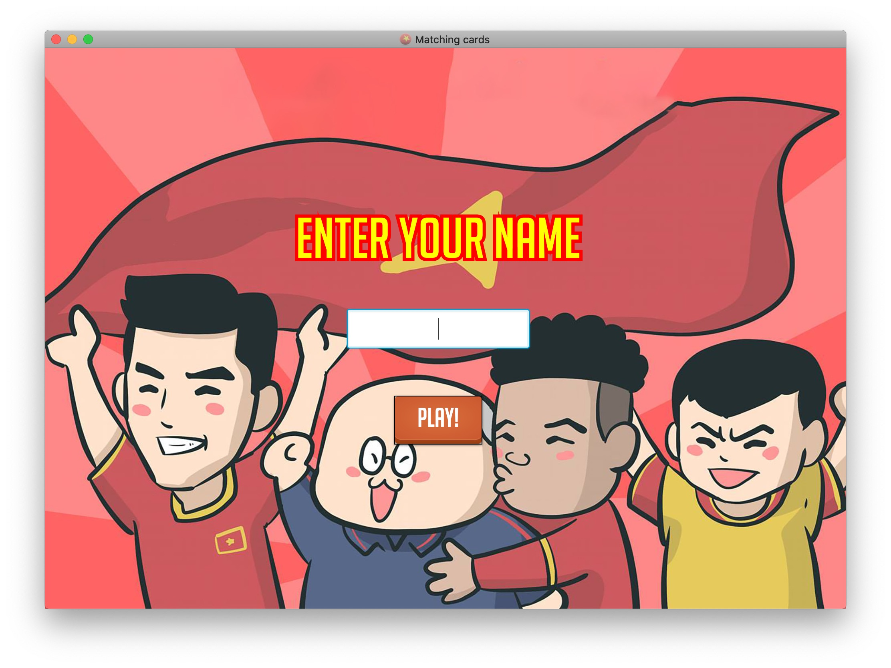
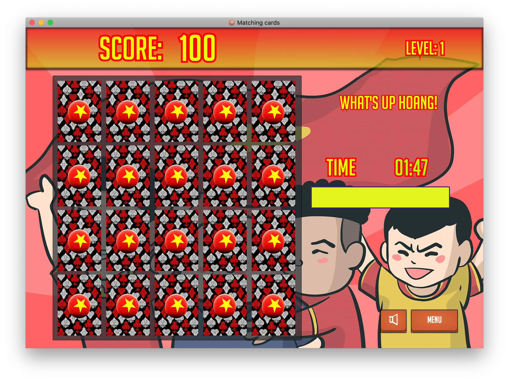

/*
  RMIT University Vietnam
  Course: INTE2512 Object-Oriented Programming
  Semester: 2019C
  Assessment: Assignment 2
  Author: Nguyen Quoc Hoang
  ID: s3697305
  Created  date: 11/12/2019
  Last modified: 16/12/2019
  Acknowledgement: javafx Media Player by Prof. Quang
*/

1. INTRODUCTION
This memory card matching game is to celebrate the cheerful victory of the Vietnam U22 Football Team.

2. FEATURES
- Card display: initially displays the back of 4x5 cards.
- Click and turn: algorithm under development.
- Level: under development.
- Time: a counter starts at 2 minutes and a progress bar indicates how much time player has left.
- Sound: can be turned on and off.
- Score: under development.
- Creative functions: say hello to user's name and added a Menu button to go back to the Menu.

3. INSTALLATION
- Unzip the project and import the project into IntelliJ.
- Setup for javafx environment.
- ATTENTION: add "javafx.media" into the VM options for the media to be played.
- ATTENTION: the whole GUI is built around "BigNoodleTitling" font. Install the fonts in the included folder to 
get the intended design as in the screenshots below:

4. KNOWN BUGS
Some features are still under development.
- Sound will be reset when go back to the Menu screen and go the game.
- Timer is also bugged when go to the Menu and go back to the Game.

5. ACKNOWLEDGEMENT
Credits to Prof. Quang for the "javafx.media" implementation for the media to be played.